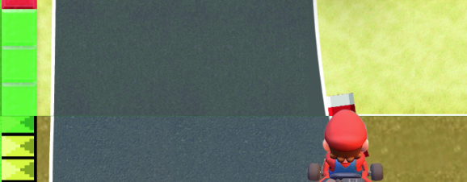

# Procesverslag
Markdown is een simpele manier om HTML te schrijven.  
Markdown cheat cheet: [Hulp bij het schrijven van Markdown](https://github.com/adam-p/markdown-here/wiki/Markdown-Cheatsheet).

Nb. De standaardstructuur en de spartaanse opmaak van de README.md zijn helemaal prima. Het gaat om de inhoud van je procesverslag. Besteedt de tijd voor pracht en praal aan je website.

Nb. Door *open* toe te voegen aan een *details* element kun je deze standaard open zetten. Fijn om dat steeds voor de relevante stuk(ken) te doen.

## Jij

### Ontwerper:
Annika Hennuin

#### Je startniveau:
Mijn startniveau is: blauw

# Je plan

  
De eerste versie/schets van je ontwerp & je persoonlijke uitdaging

  Mijn uitdaging ligt in mijn gehele ervaring in Hmtl/CSS, dit heb ik namelijk nog noit gedaan. Wel vind ik het erg leuk om aan de slag mee te gaan, omdat ik echt het gevoel heb dat ik een nieuw skill ga leren. Ik hoop tot een goed eindresultaat te komen met animaties die vloeiend verlopen en er realistisch uitzien.

  ### De eerste versie/schets:
Toelichting:
Map van Mario Kart met Mario als bestuurder. Hij rijdt langs alle soorten vraagteken boxen door de jaren heen. Wanneer hij een box aanraakt krijg je een silhouette van een item met daarin de text van de uitleg van de box.

Ideeën
- 'Fake' box, waardoor Mario uitglijdt
- Item toepassen als je de uitleg gelezen hebt.
- Map van kleur veranderen als hij een 'ander tijdperk' ingaat.
- Mario besturen met pijltjes of klikken op een vraagteken om ernaar toe te gaan, afhankelijk van moeilijkheid?
- De boxen hebben allemaal hun eigen manier van bewegen/uiterlijk, deze ook toepassen.

  
 

  ### Je ambitie: 
  Aan deze technieken/punten wil ik werken:
  - punt 1 Leren te animeren met code.
  - punt 2 Leren hoe ik een character kan besturen met pijltjes of de muis.
  - punt 3 Leren hoe ik een aantrekkelijke wereld met items maak via code.
  - ...
 

## Voortgang/Feedback 1

  
Mijn bevindingen + wijzigingen (minimaal 5)

Ik heb feedback gekregen op mijn eerste schetsen.

  ### Bevinding 1:
 Het eerste punt wat naar voren kwam is dat in plaats van een andere 'kleur overlay' bij elke variant van Mario Kart ik een thema kan toevoegen. Hierbij gaf de feedbackgever een idee van een map die je over tijd ziet veranderen.

  #### oplossing:
Om dit toe te passen ben ik opzoek gegaan naar meerdere varianten van het Mario Circuit. Hierbij heb ik gekeken naar de structuur van de grond, de weg en van het gras. Deze heb ik vervolgens apart opgezocht en hiermee verschillende achtergronden gemaakt.

<

  ### Bevinding 2:
  Het tweede punt ging over de besturing, hier heb ik verschillende mogelijkheden gehoord wat er mogelijk is. Zo kan ik scrollen met een gefixeerde positie, met pijltjes besturen of een muis volgen.
  #### oplossing:
  Uiteindelijk heb ik in overleg gekozen om te scrollen i.v.m. de moeilijkheidsgraad die hier lager ligt.

  ### Bevinding 3:
  Mijn derde feedback heb ik gekregen over de paaseieren in de game. Zo heb ik nog meer ideen gekregen wat ik hiervoor zou kunnen gebruiken. Zelf had ik al het ideen om een 'fake box' neer te zetten. Nu heb ik ook nog meer variaties die ik kan toepassen; een banaan, olievlek en mushrooms.
  #### oplossing:
  Deze ga ik toepassen in mijn animatie.

 ### Bevinding 4:
 Terwijl ik aan de slag ben gegaan ben ik tegen meerdere dingen aangelopen. Zo wilde ik graag een font van het web gebruiken voor het vraagteken in de eerst box, alleen wilde deze maar niet geactiveerd worden.
 <
#### oplossing:
Na veel Googelen lukte het nog steeds niet en ben ik met Sanne gaan zitten. Het probleem was simpel terug te leiden naar enkele punten die in de source vermelding miste.

### Bevinding 5:
Voor het tweede vierkant wilde ik deze vullen met een gradient. Vanuit de eerste instroomles had ik hier al ervaring mee, maar ook de gradient wilde niet tot stand komen. Ook hier weer veel gegoogled, maar ik kon het probleem niet vinden.
<
#### oplossing:
Uiteindelijk heb ik een gradient generator van het internet gebruikt. Dit had ik nooit eerder gedaan, maar het was eenvoudig om uit te voeren.

## Voortgang/Feedback 2

  
Mijn bevindingen + wijzigingen (minimaal 5)

  Dit is mijn ontvangen feedback:

  <
  <
  <

  ### Bevinding 1:
  Mijn eerste feedback was dat mijn elementen nog niet netjes zijn uitgelijnd. Zo is het verloop van de wegen nog niet correct. 

<

  #### oplossing:
  Dit heb ik opgelost door de wegen te herzien in Illustrator en de overgang van de wegen goed aan te laten sluiten. 
  <

  ### Bevinding 2:
  Boxen zijn uit proportie als ze een ander formaat aannemen.

  <
  
  #### oplossing:
  De boxen die niet relatief werkten heb ik opgelost door samen met Sanne hier naar te kijken. Uiteindelijk hebben we een variabele van de maat gemaakt, namelijk 60 px. Vervolgens hebben we deze variabele een relatieve waarde als 9vmin gegeven en voor de breedte de variabele aangehouden.

  <  
   <  

  ### Bevinding 3:
  Er staan twee losse IMG in github.

  #### oplossing:
   Deze heb ik verwijderd uit github. Eerst kon ik niet vinden hoe dit kon, maar na een paar minuten googelen kwam ik eruit.

  ### Bevinding 4:
  In mijn CSS is nog geen commentaar gegeven om de structuur duidelijk te maken. 

  #### oplossing:
  Ik heb overal titels toegevoegd waar de css over gaat. Denk aan Custom properties, de buttons, mario en de verschillende Li's.

  <  
   <  

  ### Bevinding 5:
  Er zijn nog een Custom Properties toegevoegd. 

  #### oplossing:
  Ik heb van alle kleuren Custom Properties gemaakt. Dit was weer even zoeken hoe het ook alweer moest. Door de powerpoints op DLO heb ik alle info weer naar boven kunnen halen. Het ging best snel en makkelijk doordat het veel kopieeren en plakken was. Wel moest ik goed kijken dat ik niet elk vlak per box een eigen custom property gaf, omdat er ook veel overlapt en ik dus dezelfde kan gebruiken.

  Hieronder zie je de originele staat van de kleuren, zonder Custom Properties en eronder als ze wel zijn toegepast.
 
  <  
  <  

  ### Bevinding 5:
  Als laatste had ik nog geen bronnen toegevoegd in mijn css, terwijl ik deze wel heb gebruikt.

   #### oplossing:
   De bronnen zijn toegevoegd en ook in de bronnenlijst gezet.

   <  

## Voortgang/Feedback 3

  
Mijn bevindingen + wijzigingen (minimaal 5)

  
  ### Bevinding 1:
  Omschrijving van wat er nog niet orde was (tekst en afbeeding(en)).

  #### oplossing:
  Beschrijving hoe je het hebt hebt opgelost of als het niet gelukt is hoe je het zou oplossen (tekst en afbeeding(en)).

  ### Bevinding 2:
  Omschrijving van wat er nog niet orde was (tekst en afbeeding(en)).

  #### oplossing:
  Beschrijving hoe je het hebt hebt opgelost of als het niet gelukt is hoe je het zou oplossen (tekst en afbeeding(en)).

  ### Bevinding 3:
  ...

## Reflectie

  
Mijn eindresultaat & persoonlijke ontwikkeling

  ### Je uitkomst - karakteristiek screenshot(s):
  

  ### Dit ging goed/Heb ik geleerd: 
  Korte omschrijving met plaatje(s)

  

  ### Dit was lastig/Is niet gelukt:
  Korte omschrijving met plaatje(s)

  

## Bronnenlijst

continu bijhouden terwijl je werkt

Nb. Wees specifiek ('css-tricks' als bron is bijv. niet specifiek genoeg).

1. bron 1
2. bron 2
3. ...

